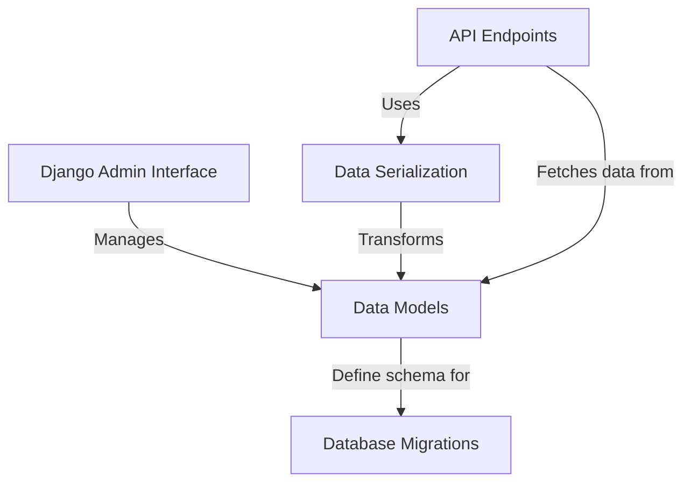
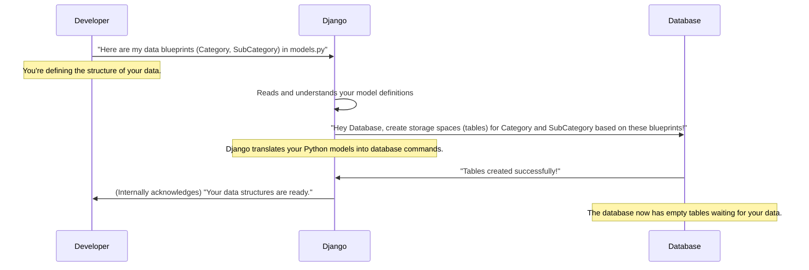
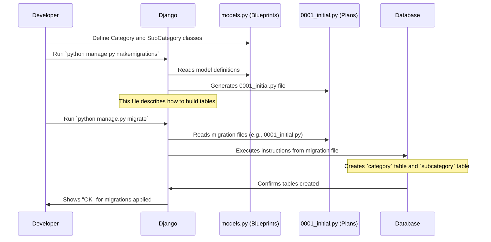
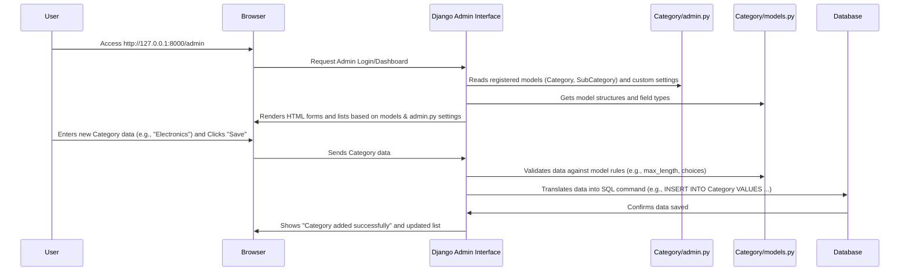
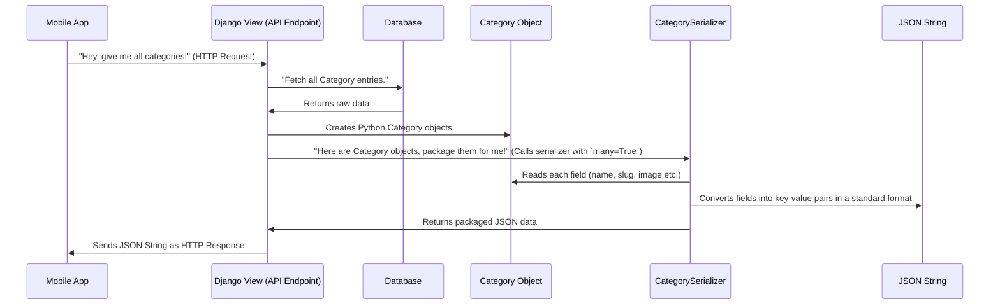
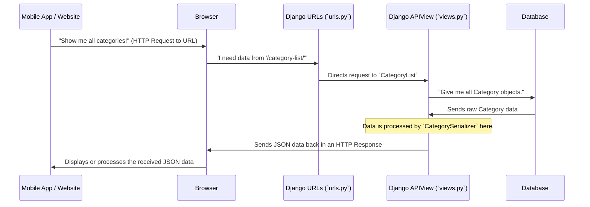

# Tutorial: document_category

This project is designed to help organize and manage different types of items by creating a system of **categories** and **subcategories**. It provides a structured way to store this information in a *database*, a user-friendly *admin panel* for administrators to add, modify, or delete categories, and an *API* that allows other applications to easily access this categorized data.


## Visual Overview



## Chapters

1. [Data Models
](document/01_data_models_.md)
2. [Database Migrations
](document/02_database_migrations_.md)
3. [Django Admin Interface
](document/03_django_admin_interface_.md)
4. [Data Serialization
](document/04_data_serialization_.md)
5. [API Endpoints
](document/05_api_endpoints_.md)

---

<sub><sup>Generated by [AI Codebase Knowledge Builder](https://github.com/The-Pocket/Tutorial-Codebase-Knowledge).</sup></sub>

# Chapter 1: Data Models

Welcome to the start of our journey with the `document_category` project! Every great project begins with a solid foundation, and for applications that handle information, this foundation is built upon something called **Data Models**.

### Imagine a Super Organized Store

Think about a well-organized grocery store. It doesn't just pile all its items randomly. Instead, items are grouped: "Dairy," "Produce," "Snacks," "Drinks," and so on. Within "Dairy," you might find "Milk," "Cheese," and "Yogurt." Each item also has specific details, like its name, a picture, and whether it's currently available.

In our `document_category` project, we need to organize information in a similar way. We want to store details about different **Categories** of items (like "Electronics" or "Books") and **SubCategories** within them (like "Laptops" under "Electronics," or "Fantasy" under "Books"). How do we tell our application what kind of information to store for each Category and SubCategory, and how they relate to each other?

This is where **Data Models** come in!

### What are Data Models? The Blueprints of Your Data

In simple terms, **Data Models are like blueprints for your data**. Just as a blueprint shows how a building is structured (where the rooms are, what materials are used), a data model tells our application:

1.  **What kind of information** each "thing" (like a Category or SubCategory) will hold.
2.  **How different "things" are connected** to each other.

In Django (the framework our project uses), these blueprints are created using Python code in files called `models.py`.

### Let's Look at Our Project's Blueprints

Our `document_category` project primarily uses two main blueprints: `Category` and `SubCategory`. Let's explore them.

#### The `Category` Blueprint

The `Category` model is our blueprint for major groups, like "Electronics" or "Apparel." It specifies what details each category entry will have:

```python
# Category/models.py

from django.db import models

class Category(models.Model):
    # What kind of data will each Category entry have?
    name = models.CharField(max_length=50)
    slug = models.SlugField(max_length=100, unique=True)
    image = models.ImageField(upload_to='photos/categories', blank=True)
    status = models.CharField(max_length=10, choices=[('active', 'active'), ('deactive', 'deactive')], default='active')

    class Meta:
        verbose_name = 'category' # How Django refers to a single Category
        verbose_name_plural = 'categories' # How Django refers to multiple Categories

    def __str__(self):
        return self.name # What to show when we print a Category object
```

Let's break down what each line means:

*   `class Category(models.Model):`: This tells Django we're creating a new data model named `Category`. `models.Model` is like the basic template for all our data blueprints.
*   `name = models.CharField(max_length=50)`: This says every `Category` entry must have a `name`. `CharField` means it's a short piece of text, and `max_length=50` limits it to 50 characters.
*   `slug = models.SlugField(...)`: A `slug` is a URL-friendly version of the name (e.g., "electronics-items" instead of "Electronics Items"). `unique=True` means no two categories can have the same slug.
*   `image = models.ImageField(...)`: This field is for storing an image associated with the category. `blank=True` means it's optional; you don't *have* to provide an image.
*   `status = models.CharField(...)`: This helps us know if a category is `active` or `deactive`. The `choices` option makes sure we only pick one of these two values.
*   `class Meta:`: This is a special section where we give Django extra information about our model, like what to call it in plural form (`verbose_name_plural`).
*   `def __str__(self):`: This little function just makes it easy for us to see the `name` of the category whenever we look at a `Category` object in our code.

#### The `SubCategory` Blueprint (and Relationships!)

Now, let's look at the `SubCategory` model. Subcategories, like "Laptops" or "Fantasy Books," always belong to a larger `Category`. This is where data relationships come in!

```python
# Category/models.py (continued in the same file)

class SubCategory(models.Model):
    # This is the important part: linking SubCategory to Category!
    category = models.ForeignKey(Category, on_delete=models.CASCADE)

    # What kind of data will each SubCategory entry have?
    sub_name = models.CharField(max_length=50)
    slug = models.CharField(max_length=50)
    unit = models.CharField(max_length=3, choices=[('kg','kg'), ('pcs','pcs')])
    sub_image = models.ImageField(upload_to='photos/SubCategory', blank=True)
    percentage = models.FloatField(default=0) # Example numerical field
    GST = models.FloatField(default=0) # Another numerical field
    status = models.CharField(max_length=10, choices=[('active', 'active'), ('deactive', 'deactive')], default='active')

    class Meta:
        verbose_name = 'Subcategory'
        verbose_name_plural = 'Subcategories'

    def __str__(self):
        return self.sub_name
```

The most important part here is:

*   `category = models.ForeignKey(Category, on_delete=models.CASCADE)`: This line creates the "link" or "relationship." It says that every `SubCategory` entry *must* be connected to a `Category` entry.
    *   `ForeignKey` means it's a "one-to-many" relationship: one `Category` can have many `SubCategory` items, but each `SubCategory` belongs to only one `Category`.
    *   `on_delete=models.CASCADE`: This is a rule. It means if you delete a `Category` (e.g., "Electronics"), all its linked `SubCategory` items (like "Laptops," "Smartphones") will also be deleted automatically. It prevents "orphan" data.

### How Does Django Use These Blueprints?

When you define these models in `models.py`, you're essentially giving Django a set of instructions. Django then uses these instructions to create the actual storage places (like tables in a database) for your data.

Here's a simple idea of what happens behind the scenes:



In the next chapter, we'll learn the specific command we use to tell Django to *actually* create these storage spaces in our database. It's a process called [Database Migrations](document/02_database_migrations_.md).

### Conclusion

In this chapter, we've learned that **Data Models** are the fundamental blueprints for organizing information in our `document_category` project. They define:

*   **What data each entry holds** (e.g., a `Category` has a `name`, `image`, `status`).
*   **How different pieces of data are connected** (e.g., a `SubCategory` belongs to a `Category` using `ForeignKey`).

These blueprints, defined in `models.py`, are the first crucial step in setting up our application's data structure.

Now that we understand how to define our data's structure, let's move on to the next step: actually building these structures in our database. This is where [Database Migrations](document/02_database_migrations_.md) come into play!

---

<sub><sup>Generated by [AI Codebase Knowledge Builder](https://github.com/The-Pocket/Tutorial-Codebase-Knowledge).</sup></sub> <sub><sup>**References**: [[1]](https://github.com/snehabansal483/document_category/blob/277478989331eedb1362c71cf1b167d6ac739b2a/Category/migrations/0001_initial.py), [[2]](https://github.com/snehabansal483/document_category/blob/277478989331eedb1362c71cf1b167d6ac739b2a/Category/models.py)</sup></sub>


# Chapter 2: Database Migrations

Welcome back! In [Chapter 1: Data Models](document/01_data_models_.md), we learned that **Data Models** are like blueprints for our application's information. We defined what a `Category` and a `SubCategory` look like, and how they relate to each other in Python code (our `models.py` file).

But here's the thing: defining blueprints in Python code doesn't magically create the actual storage spaces in our database. It's like having a detailed architectural drawing for a house; you still need to lay the foundation and build the walls!

This is where **Database Migrations** come in.

### From Blueprints to Building: The Need for Migrations

Imagine you've drawn up your blueprints for `Category` and `SubCategory`. You want your application to actually store "Electronics" or "Laptops" information. How do you tell your database to get ready for this?

And what happens if later you decide a `Category` needs a new field, like `description`? Or maybe you want to change the `max_length` of a field? Manually going into the database and making changes can be risky, hard to track, and difficult to repeat on different computers or servers.

**Database Migrations solve these problems.** They are special files that act like a step-by-step instruction manual for your database. They describe how to build your database tables from scratch, or how to change them as your project grows. Think of them as **version control for your database's structure**.

Our goal in this chapter is to understand how to use migrations to turn our `Category` and `SubCategory` blueprints into actual tables in our database.

### Key Concepts: What are Migrations?

1.  **Instructions for the Database**: Migrations are Python files (automatically generated by Django) that contain instructions for modifying your database's structure. These instructions are typically things like "create a new table," "add a new column," or "delete an old column."
2.  **Tracking Changes**: Each time you make a change to your data models (e.g., adding a new field to your `Category` model), Django can create a new migration file. This file records *that specific change*. This way, you have a history of all changes made to your database's structure, just like you have a history of code changes in Git.
3.  **The `0001_initial.py` File**: When you first create your models, Django generates an initial migration file (often named `0001_initial.py`). This file contains all the instructions needed to create your *entire* database structure based on your initial [Data Models](document/01_data_models_.md). It's the "start building everything" instruction. You can find it in the `Category/migrations/` folder.

### How to Use Migrations: Building Our Database

Django provides two main commands to work with migrations:

1.  `makemigrations`: This command looks at your `models.py` file, compares it to the current state of your migration files, and generates *new* migration files if it detects any changes. It's like asking Django, "What changes do I need to prepare for?"
2.  `migrate`: This command takes those migration files and applies the instructions within them to your actual database. It's like telling Django, "Okay, now actually perform those changes on the database!"

Let's see them in action.

#### Step 1: Preparing the Migration Files (`makemigrations`)

First, we need to tell Django to create the migration files based on our `Category` and `SubCategory` models.

Open your terminal or command prompt, navigate to your project's root directory (where `manage.py` is located), and run:

```bash
python manage.py makemigrations
```

**What happens?**

Django will scan your `models.py` files. Since this is the first time (or the first time after making changes), it will detect your `Category` and `SubCategory` models as brand new structures. It will then generate a new file in your `Category/migrations/` folder.

You'll see output similar to this:

```
Migrations for 'Category':
  Category/migrations/0001_initial.py
    - Create model Category
    - Create model SubCategory
```

This output tells you:
*   A new migration file named `0001_initial.py` has been created inside the `Category/migrations/` folder.
*   This file contains instructions to "Create model Category" and "Create model SubCategory".

**Important**: Running `makemigrations` *does not* change your database yet. It only creates the Python files that describe the changes. These files are like the detailed construction plans that are drawn up but not yet acted upon.

#### Step 2: Applying the Changes to the Database (`migrate`)

Now that we have our migration files (our instructions), we need to tell Django to actually apply these instructions to our database.

In your terminal, run:

```bash
python manage.py migrate
```

**What happens?**

Django will look at all the migration files in all your apps, determine which ones haven't been applied to the database yet, and then execute their instructions.

You'll see output similar to this:

```
Operations to perform:
  Apply all migrations: admin, auth, Category, contenttypes, sessions
Running migrations:
  Applying contenttypes.0001_initial... OK
  Applying auth.0001_initial... OK
  Applying admin.0001_initial... OK
  Applying admin.0002_logentry_rename_action_flag... OK
  Applying admin.0003_logentry_add_action_flag_choices... OK
  Applying Category.0001_initial... OK
  Applying sessions.0001_initial... OK
```

This output shows that Django is applying migrations for several built-in Django apps (like `admin`, `auth`, `sessions`) and, most importantly for us, `Category.0001_initial`. The "OK" means it successfully applied those changes.

**Congratulations!** Your `Category` and `SubCategory` blueprints have now been translated into actual tables in your database, ready to store your data!

### Under the Hood: How it All Connects

Let's visualize the process and peek into the generated migration file.

First, recall our [Data Models](document/01_data_models_.md) in `Category/models.py`. These are the blueprints:

```python
# Category/models.py (simplified)

from django.db import models

class Category(models.Model):
    name = models.CharField(max_length=50)
    # ... other fields for Category ...

class SubCategory(models.Model):
    category = models.ForeignKey(Category, on_delete=models.CASCADE)
    sub_name = models.CharField(max_length=50)
    # ... other fields for SubCategory ...
```

When you run `python manage.py makemigrations`, Django reads these Python classes. It then translates them into Python code that describes database operations. This translated code goes into a new file, like `Category/migrations/0001_initial.py`.

Here's a *simplified* look at what that `0001_initial.py` file might contain, focusing on the `Category` model for brevity:

```python
# Category/migrations/0001_initial.py (simplified snippet)

from django.db import migrations, models

class Migration(migrations.Migration):
    initial = True
    dependencies = []
    operations = [
        migrations.CreateModel(
            name='Category',
            fields=[
                ('id', models.BigAutoField(auto_created=True, primary_key=True, serialize=False, verbose_name='ID')),
                ('name', models.CharField(max_length=50)),
                # ... more field definitions here, automatically generated ...
            ],
            options={
                'verbose_name': 'category',
                'verbose_name_plural': 'categories',
            },
        ),
        # ... Similar code for creating the 'SubCategory' model/table ...
    ]
```

Notice the `migrations.CreateModel` part. This is the core instruction. It tells Django: "Hey, when you run this migration, create a database table named 'Category' with these specific columns (fields) like 'id' and 'name'."

The `SubCategory` table creation instructions are also in this same `0001_initial.py` file, including the `ForeignKey` relationship to `Category`.

Here's how the whole process flows:



This sequence shows that `makemigrations` is about *preparing* the database changes by writing them into files, and `migrate` is about *applying* those prepared changes to the actual database.

### Conclusion

In this chapter, we've unlocked a crucial part of building robust applications: **Database Migrations**. We learned that:

*   Migrations are like version control for your database structure, allowing you to track and apply changes systematically.
*   `python manage.py makemigrations` creates the Python files that describe your database changes (e.g., `0001_initial.py`).
*   `python manage.py migrate` applies those changes to your actual database, building or updating tables.

You've now successfully translated your [Data Models](document/01_data_models_.md) into real storage spaces in your database! But how do we actually *see* and *manage* the data inside these tables without writing complex code? That's what we'll explore in the next chapter: [Django Admin Interface](document/03_django_admin_interface_.md)!

---

<sub><sup>Generated by [AI Codebase Knowledge Builder](https://github.com/The-Pocket/Tutorial-Codebase-Knowledge).</sup></sub> <sub><sup>**References**: [[1]](https://github.com/snehabansal483/document_category/blob/277478989331eedb1362c71cf1b167d6ac739b2a/Category/migrations/0001_initial.py), [[2]](https://github.com/snehabansal483/document_category/blob/277478989331eedb1362c71cf1b167d6ac739b2a/Category/models.py)</sup></sub>


# Chapter 3: Django Admin Interface

Welcome back! In our last chapter, [Chapter 2: Database Migrations](document/02_database_migrations_.md), we learned how to use Django's migration system to turn our data blueprints (defined in [Chapter 1: Data Models](document/01_data_models_.md)) into actual storage spaces – tables – in our database. You've successfully built the foundation and even the framework of your data storage!

But now that we have these empty tables, how do we put data into them? How do we add a new "Electronics" category, or a "Laptops" subcategory, and then later edit or delete them? Doing this directly by writing code or messing with the database itself can be tricky and prone to errors.

Imagine you have a beautifully designed car. You know where the engine is, how the wheels work, and how the gears are connected (our data models and migrations!). But to *drive* it, you don't need to be a mechanic; you need a dashboard with simple controls like a steering wheel, accelerator, and brake pedal.

This is exactly what the **Django Admin Interface** provides for your project!

### What is the Django Admin Interface? Your Project's Dashboard

The Django Admin Interface is a powerful, built-in, web-based control panel that comes with every Django project. It's designed to help you, the administrator, easily manage your project's data without writing a single line of web application code.

Think of it as your project's **dashboard**. Just like a car's dashboard gives you controls for its functions (speed, fuel, lights), the Django Admin allows authorized users to:

*   **Create** new data entries (e.g., add a new `Category` called "Sports").
*   **View** all existing data (e.g., see a list of all `Categories` and `SubCategories`).
*   **Update** (or edit) existing data (e.g., change "Sports" to "Outdoor & Sports").
*   **Delete** data entries (e.g., remove an old `SubCategory`).

All of this happens through a user-friendly web interface that Django automatically generates for you, based on your [Data Models](document/01_data_models_.md).

Our goal in this chapter is to understand how to get access to this dashboard and use it to manage our `Category` and `SubCategory` data.

### Key Concepts

1.  **Built-in & Automatic**: The Django Admin is part of Django itself. Once you define your [Data Models](document/01_data_models_.md) and run [Database Migrations](document/02_database_migrations_.md), Django can automatically create a basic administration interface for them.
2.  **`admin.py`**: This is the special Python file in your app (e.g., `Category/admin.py`) where you "tell" Django which of your models you want to see in the admin dashboard and how you want them to look. It's where you customize the dashboard's controls and display for your data.
3.  **Superuser**: To access the Django Admin dashboard, you need special permission. You'll log in as a "superuser," which is an account with full administrative powers.

### How to Use the Django Admin: Managing Our Data

Let's get our dashboard up and running!

#### Step 1: Create a Superuser Account

First, we need an administrator account to log into the admin panel. This is a one-time setup step.

Open your terminal or command prompt, navigate to your project's root directory (where `manage.py` is located), and run:

```bash
python manage.py createsuperuser
```

**What happens?**

Django will ask you for a username, email address (optional), and a password for your new superuser account.

```
Username (leave blank to use 'your_username'): admin
Email address: admin@example.com
Password:
Password (again):
Superuser created successfully.
```

Choose a simple username and password for now (like `admin`/`admin123`) for learning purposes. Make sure you remember them!

#### Step 2: Start the Development Server

Next, we need to run our Django project so we can access it through our web browser.

In your terminal, run:

```bash
python manage.py runserver
```

**What happens?**

Django will start a small web server on your computer. You'll see output like this:

```
Performing system checks...

System check identified no issues (0 silenced).

You can now view your project at:

  http://127.0.0.1:8000/
```

This tells you your project is now running and can be accessed in your web browser at the given address.

#### Step 3: Access the Django Admin Dashboard

Open your web browser and go to the address `http://127.0.0.1:8000/admin`.

You will see a login page for the Django administration. Enter the username and password you created in Step 1.

**Congratulations!** You're now on your project's administrative dashboard. You'll see some default sections like "Authentication and Authorization" (for managing users and groups). However, our `Category` and `SubCategory` models aren't visible yet.

#### Step 4: Register Our Models in `admin.py`

For our `Category` and `SubCategory` models to appear and be manageable in the admin dashboard, we need to "register" them in the `admin.py` file within our `Category` app. This file also allows us to customize how these models look and behave in the admin.

Let's look at the `Category/admin.py` file:

```python
# Category/admin.py
from django.contrib import admin
from .models import Category, SubCategory # 1. Import our models
from django.utils.html import format_html # Needed for image display
import admin_thumbnails # Special tool for image display

# 2. Customize how Category model looks in admin
class CategoryAdmin(admin.ModelAdmin):
    def thumbnail(self, object):
        # A small function to show a tiny image in the list
        return format_html(''.format(object.image.url))
    thumbnail.short_description = "Image" # Label for the image column

    # Automatically fill the 'slug' field based on 'name'
    prepopulated_fields = {'slug': ('name',)}
    # What columns to show in the list view
    list_display = ('id', 'name', 'slug', 'thumbnail', 'status')
    # Which columns should be clickable links to edit the item
    list_display_links = ('id', 'name', 'slug', 'thumbnail')

# 3. Customize how SubCategory model looks in admin
@admin_thumbnails.thumbnail('sub_image') # Use admin_thumbnails to show image easily
class SubCategoryAdmin(admin.ModelAdmin):
    # This 'thumbnail' function is simpler because of @admin_thumbnails
    def thumbnail(self, object):
        return format_html(''.format(object.sub_image.url))
    thumbnail.short_description = "SubImage"

    # Automatically fill the 'slug' field based on 'sub_name'
    prepopulated_fields = {'slug': ('sub_name',)}
    # What columns to show in the list view
    list_display= ('id', 'sub_name', 'slug', 'category', 'thumbnail', 'unit', 'percentage', 'status')
    # Which columns should be clickable links to edit the item
    list_display_links = ('id', 'sub_name', 'slug', 'category', 'thumbnail')

# 4. Tell Django Admin to include our models using our custom settings
admin.site.register(Category, CategoryAdmin)
admin.site.register(SubCategory, SubCategoryAdmin)
```

**Let's break down the important parts:**

1.  `from .models import Category, SubCategory`: We import our blueprints (models) from the `models.py` file so we can tell Django about them.
2.  `class CategoryAdmin(admin.ModelAdmin):`: This is a special class that tells Django how to display and manage our `Category` model in the admin.
    *   `prepopulated_fields = {'slug': ('name',)}`: This is super handy! When you type a `name` for a new category, Django will automatically fill in the `slug` field (the URL-friendly version) for you.
    *   `list_display = ('id', 'name', 'slug', 'thumbnail', 'status')`: This determines which columns appear when you view a list of categories in the admin. `thumbnail` is a custom column we created to show a small image.
    *   The `thumbnail` function and `admin_thumbnails` (an optional helper tool) are used to display a small preview of the image directly in the list, making it more visual.
3.  `class SubCategoryAdmin(admin.ModelAdmin):`: This is similar to `CategoryAdmin`, but it applies to our `SubCategory` model. It also uses `prepopulated_fields` and `list_display` for easy management. Notice `category` in `list_display` – this automatically shows which main `Category` each `SubCategory` belongs to!
4.  `admin.site.register(Category, CategoryAdmin)` and `admin.site.register(SubCategory, SubCategoryAdmin)`: These are the crucial lines! They "register" our `Category` and `SubCategory` models with the Django Admin. We also tell Django to use our custom `CategoryAdmin` and `SubCategoryAdmin` classes to control their appearance.

After you save changes to `Category/admin.py` (if the server is running, it will usually reload automatically), refresh your browser page at `http://127.0.0.1:8000/admin`.

**Now you should see "Categories" and "Subcategories" listed under your "CATEGORY" app!**

#### Step 5: Managing Data Through the Admin

Click on "Categories." You'll see a list of categories (currently empty).

*   Click "Add category" on the top right.
*   Fill in a `name` (e.g., "Electronics"). Watch how the `slug` field automatically fills in!
*   You can upload an `image` and set the `status`.
*   Click "Save."

You've just created your first `Category` entry *without writing any backend code* for it! Repeat this for a few categories.

Now, go back to the main admin page and click on "Subcategories."

*   Click "Add subcategory."
*   Fill in `sub_name` (e.g., "Laptops"). The `slug` will again prepopulate.
*   **Important:** Select a `Category` from the dropdown list (e.g., "Electronics"). This is how you link a SubCategory to its parent Category, leveraging the `ForeignKey` relationship we defined in [Chapter 1: Data Models](document/01_data_models_.md).
*   Fill in other details like `unit`, `percentage`, and `GST`.
*   Click "Save."

You can now easily create, view, edit (by clicking on an existing item), and delete (by selecting items and using the "Action" dropdown) your data through this powerful interface.

### Under the Hood: How the Admin Works Its Magic

How does Django turn your simple Python definitions into a fully functional web interface?

Let's trace the journey when you use the Django Admin:



Essentially, when you access the admin, Django reads your `admin.py` file to see *which* models you want to manage and *how*. It then consults your `models.py` for the actual structure of those models (what fields they have, their types, relationships). Using all this information, Django dynamically generates the necessary HTML forms, tables, and buttons to let you interact with your database. When you save changes, Django handles all the complex database queries for you.

### Conclusion

In this chapter, you've gained a fundamental understanding of the **Django Admin Interface**:

*   It's a **built-in, secure control panel** for managing your project's data without writing web code.
*   You use `python manage.py createsuperuser` to get an **admin account**.
*   You "register" your [Data Models](document/01_data_models_.md) in your app's `admin.py` file to make them visible and manageable in the admin.
*   The `admin.py` file also allows you to **customize** how your models are displayed and managed (e.g., which columns to show, how fields are pre-filled).

You now have a powerful tool to populate and maintain your `Category` and `SubCategory` data! But what if we want to get this data *out* of our database and present it in a standard format that other applications (like mobile apps or websites) can understand? That's where **Data Serialization** comes in, which we'll explore in the next chapter!

[Chapter 4: Data Serialization](document/04_data_serialization_.md)

---

<sub><sup>Generated by [AI Codebase Knowledge Builder](https://github.com/The-Pocket/Tutorial-Codebase-Knowledge).</sup></sub> <sub><sup>**References**: [[1]](https://github.com/snehabansal483/document_category/blob/277478989331eedb1362c71cf1b167d6ac739b2a/Category/admin.py)</sup></sub>


# Chapter 4: Data Serialization

Welcome back, aspiring developer! In our previous chapter, [Chapter 3: Django Admin Interface](document/03_django_admin_interface_.md), we learned how to easily manage our `Category` and `SubCategory` data directly within our Django project's dashboard. You can now add, view, edit, and delete data using a user-friendly web interface. That's great for administrators!

But what if you want to share this data with other applications? Imagine you're building:

*   A **mobile app** that needs to display all product categories.
*   A **different website** (perhaps built with a different technology) that wants to list your subcategories.
*   A **JavaScript application** running in a user's browser that needs to fetch category information.

These external applications don't understand Django's internal `Category` or `SubCategory` objects directly. They speak different languages, but they all understand a few universal data formats, like **JSON** (JavaScript Object Notation) or XML.

This is where **Data Serialization** comes in!

### What is Data Serialization? Packaging Your Data for Travel

Imagine you have a beautifully crafted, complex object in your hands – say, a detailed `Category` object in our Django system, which has a `name`, an `image`, a `status`, and more. Now, you need to send this object through the internet to a friend (another program) who lives far away.

You can't just mail the object itself! You need to:

1.  **Package it up:** Convert the complex object into a simple, standardized format, like a neatly written list of its properties on a piece of paper, or packing it into a universally recognized shipping box. This "paper list" or "shipping box" is often **JSON**.
2.  **Send it:** Transmit this simple, standardized package over the internet.

**Data Serialization is the process of converting complex data (like our Django `Category` or `SubCategory` objects) into a simple, standardized format (like JSON or XML) that can be easily stored, transmitted, and understood by different systems.**

The reverse process, converting the simple format back into a complex object, is called **Deserialization**.

In our `document_category` project, we'll use a powerful tool called **Django REST Framework** (DRF) to handle serialization. The conversion rules are defined in a special file: `Category/serializers.py`. This file ensures our data can be neatly packaged and sent as a readable string, and also converted back from a string into an object if needed.

### Key Concepts for Data Serialization

1.  **Serialization**: The act of converting complex data (like a Django model instance) into a simple, universally understood format (like JSON or XML).
2.  **Deserialization**: The act of converting the simple, universally understood format back into a complex data object.
3.  **JSON (JavaScript Object Notation)**: A very popular, lightweight text-based data exchange format. It's easy for humans to read and write, and easy for machines to parse and generate. It looks like a collection of key-value pairs, similar to Python dictionaries.
4.  **`serializers.py`**: In Django REST Framework, this is the Python file where you define the "rules" or "blueprints" for how your Django models should be converted into JSON (or other formats) and vice-versa.
5.  **`ModelSerializer`**: A special class provided by Django REST Framework that makes it incredibly easy to create serializers directly from your Django models. It automatically maps model fields to serializer fields.

### How to Use Data Serialization for Our Categories

Let's see how our `serializers.py` file helps us package our `Category` and `SubCategory` data.

First, recall our `Category` model from [Chapter 1: Data Models](document/01_data_models_.md). When you retrieve a `Category` from the database, it's a Python object like this:

```python
# Imagine this is a Category object in Python
my_category_object = {
    'id': 1,
    'name': 'Electronics',
    'slug': 'electronics',
    'image': '/media/photos/categories/electronics.jpg',
    'status': 'active'
}
```

We want to convert this into a JSON string that looks something like this, so a mobile app can easily read it:

```json
{
    "id": 1,
    "name": "Electronics",
    "slug": "electronics",
    "image": "http://example.com/media/photos/categories/electronics.jpg",
    "status": "active"
}
```

Here's how we define the rules for this conversion in `Category/serializers.py`:

```python
# Category/serializers.py (Simplified)
from rest_framework import serializers
from .models import Category, SubCategory

# Define the packing instructions for our Category objects
class CategorySerializer(serializers.ModelSerializer):
    class Meta: # This inner class gives instructions to ModelSerializer
        model = Category # Tell it which Django Model this serializer is for
        fields = '__all__' # Tell it to include ALL fields from the Category model
```

**Explanation:**

*   `from rest_framework import serializers`: We import the necessary tools from Django REST Framework.
*   `from .models import Category, SubCategory`: We import our Django models that we want to serialize.
*   `class CategorySerializer(serializers.ModelSerializer):`: We create a new serializer called `CategorySerializer`. By inheriting from `serializers.ModelSerializer`, we tell Django REST Framework to automatically figure out how to convert a `Category` model instance.
*   `class Meta:`: This special inner class holds configurations for our serializer.
*   `model = Category`: This line is crucial! It links our `CategorySerializer` directly to our `Category` Django model.
*   `fields = '__all__':` This tells the serializer to include *all* the fields from the `Category` model (`id`, `name`, `slug`, `image`, `status`) in the serialized output. It's a quick way to include everything. You could also list specific fields if you only wanted some of them, like `fields = ('name', 'status')`.

We do something similar for our `SubCategory` model:

```python
# Category/serializers.py (Simplified, continued)

class AllSubCategorySerializer(serializers.ModelSerializer):
    class Meta:
        model = SubCategory
        fields = '__all__'
```

This `AllSubCategorySerializer` works just like `CategorySerializer`, but it's for `SubCategory` objects. It will convert all fields of a `SubCategory` object into a simple format.

#### Using Serializers in Practice

These serializers are then used in our **API Endpoints** (which we'll cover in detail in [Chapter 5: API Endpoints](document/05_api_endpoints_.md)) to prepare data before sending it out.

For example, in `Category/views.py`, when a request comes in asking for a list of categories:

```python
# Category/views.py (Simplified)
from rest_framework.views import APIView
from rest_framework.response import Response
from .serializers import CategorySerializer, AllSubCategorySerializer # Import our serializers
from .models import Category, SubCategory

class CategoryList(APIView):
    def get(self, request):
        # 1. Get all Category objects from the database
        all_categories = Category.objects.all()

        # 2. Pass them to our CategorySerializer for packaging
        # `many=True` means we're serializing a list of objects, not just one
        serializer = CategorySerializer(all_categories, many=True)

        # 3. Return the packaged data (which is now in a simple format, like JSON)
        return Response(serializer.data)

class AllSubCategoryList(APIView):
    def get(self, request):
        all_subcategories = SubCategory.objects.all()
        serializer = AllSubCategorySerializer(all_subcategories, many=True)
        return Response(serializer.data)
```

**What happens when `serializer.data` is accessed?**

If `all_categories` contains two `Category` objects:
`Category(id=1, name='Electronics', ...)`
`Category(id=2, name='Books', ...)`

The `serializer.data` will produce a list of dictionaries, which Django REST Framework then automatically converts into a JSON string that looks like this:

```json
[
    {
        "id": 1,
        "name": "Electronics",
        "slug": "electronics",
        "image": "http://example.com/media/photos/categories/electronics.jpg",
        "status": "active"
    },
    {
        "id": 2,
        "name": "Books",
        "slug": "books",
        "image": "http://example.com/media/photos/categories/books.jpg",
        "status": "active"
    }
]
```

This JSON string is what gets sent over the internet to the mobile app or other website. They can then easily read this standardized data.

### Under the Hood: The Serialization Process

Let's visualize how your Django model object gets transformed into a JSON string ready for transport.



**Diving a bit deeper into `serializers.py`:**

When you define `CategorySerializer(serializers.ModelSerializer)` and set `model = Category` and `fields = '__all__'`, Django REST Framework intelligently:

1.  **Inspects `Category` model**: It looks at the `Category` model you defined in `models.py` (from [Chapter 1: Data Models](document/01_data_models_.md)) and understands all its fields (`name`, `slug`, `image`, `status`, plus an automatic `id`).
2.  **Creates corresponding serializer fields**: For each model field, it creates a matching serializer field that knows how to convert data to/from the Python object and the target format (like JSON). For example, `models.CharField` becomes `serializers.CharField`.
3.  **Handles relationships**: Even `ForeignKey` relationships are handled.
    *   For `AllSubCategorySerializer`, when `fields = '__all__'` is used, the `category` field (which is a `ForeignKey` to `Category`) will typically show up as the `id` of the related `Category` object in the JSON. For example, a `SubCategory` for "Laptops" might show `{"id": 101, "sub_name": "Laptops", "category": 1, ...}` where `1` is the `id` of the "Electronics" `Category`.
    *   There's also another serializer defined in the project, `SubCategorySerializer`, which shows a more advanced example using `serializers.StringRelatedField()`:

        ```python
        # Category/serializers.py (Snippet for custom behavior)

        class SubCategorySerializer(serializers.ModelSerializer):
            # Instead of just showing the Category ID, this will show the Category's name!
            sub_name = serializers.StringRelatedField()
            class Meta:
                model = SubCategory
                fields = '__all__'
        ```
        In this specific `SubCategorySerializer`, `sub_name = serializers.StringRelatedField()` is used. This means that instead of displaying the ID of the related `Category` in the JSON, it would display the `__str__` representation of the `Category` object (which we defined as `return self.name` in our `Category` model). So, a "Laptops" subcategory might show `{"id": 101, "sub_name": "Laptops", "category": "Electronics", ...}`. This demonstrates how serializers give you fine-grained control over the output.

By using `serializers.ModelSerializer`, much of this complex mapping is done automatically, making it very efficient to prepare our data for the outside world.

### Conclusion

In this chapter, we've explored the essential concept of **Data Serialization**:

*   It's the process of **packaging complex data** (like our Django model objects) into a simple, universal format (like **JSON**) for storage or transmission.
*   The `Category/serializers.py` file contains the **rules** for this packaging using Django REST Framework's `ModelSerializer`.
*   `ModelSerializer` automatically maps your Django model fields to fields in the serialized output, making the process straightforward.
*   This serialized data is then ready to be sent to other applications (like mobile apps or other websites) that don't directly understand Django's internal objects.

You now understand how our organized data can be transformed into a portable format. In the next chapter, we'll put these serializers to work by creating actual **API Endpoints** that external applications can call to fetch our category and subcategory data!

[Chapter 5: API Endpoints](document/05_api_endpoints_.md)

---

<sub><sup>Generated by [AI Codebase Knowledge Builder](https://github.com/The-Pocket/Tutorial-Codebase-Knowledge).</sup></sub> <sub><sup>**References**: [[1]](https://github.com/snehabansal483/document_category/blob/277478989331eedb1362c71cf1b167d6ac739b2a/Category/serializers.py), [[2]](https://github.com/snehabansal483/document_category/blob/277478989331eedb1362c71cf1b167d6ac739b2a/Category/views.py)</sup></sub>


# Chapter 5: API Endpoints

Welcome to the final chapter of our `document_category` project tutorial! In our journey so far, we've laid a strong foundation:

*   In [Chapter 1: Data Models](document/01_data_models_.md), we created the blueprints for our `Category` and `SubCategory` data.
*   In [Chapter 2: Database Migrations](document/02_database_migrations_.md), we used those blueprints to build actual storage spaces (tables) in our database.
*   In [Chapter 3: Django Admin Interface](document/03_django_admin_interface_.md), we learned how to easily add and manage data in those tables using a web dashboard.
*   And most recently, in [Chapter 4: Data Serialization](document/04_data_serialization_.md), we learned how to "package" our complex Django data into a simple, universal format like JSON, ready for travel across the internet.

Now that our data is beautifully organized, stored, and packaged, how do other computer programs or websites actually *get* it? How does a mobile app know where to ask for the list of categories? How does a separate front-end website know where to send a request for all subcategories?

This is where **API Endpoints** come into play!

### What are API Endpoints? Your Data's Doorways

Think of your Django project as a building that holds valuable information (your `Category` and `SubCategory` data). This building has many rooms (your models, views, etc.). For external visitors (other applications) to get specific information, they don't wander through the whole building. Instead, they need a specific address or **doorway** to knock on.

**API Endpoints are these specific doorways or addresses that other computer programs (like mobile apps, websites, or other services) can visit to either request or send data.**

Each endpoint is a unique URL (a web address) that, when visited, triggers a specific action on your server. For our `document_category` project, URLs like `/category-list/` and `/all-subcategory-list/` are these addresses.

When an external application "visits" one of these endpoints:

1.  Your Django project recognizes the address.
2.  It directs the request to a specific **`APIView`** (which acts like a doorman or processor).
3.  This `APIView` then fetches the necessary data from the database.
4.  It uses a **`Serializer`** (as we learned in [Chapter 4: Data Serialization](document/04_data_serialization_.md)) to package the data into a standard format (like JSON).
5.  Finally, it sends this packaged data back to the requesting application.

This entire process makes your project's data accessible and usable by any other application or front-end interface, making your project a useful "API" (Application Programming Interface).

### Key Concepts

1.  **URL (Uniform Resource Locator)**: The actual web address (e.g., `http://127.0.0.1:8000/category-list/`) that identifies an API Endpoint.
2.  **`path()`**: A Django function used in `urls.py` to define these URLs and link them to specific "views."
3.  **`APIView`**: A special class provided by Django REST Framework (DRF) that processes requests coming into an endpoint. It handles different types of requests (like "GET" for requesting data, "POST" for sending new data, etc.). It's like the "doorman" or "processor" that handles requests at a specific doorway.
4.  **`Response`**: A Django REST Framework object used by the `APIView` to send data back to the requesting application. This is where your serialized (packaged) data goes.

### How to Use API Endpoints: Making Our Data Available

Let's look at how our project sets up these doorways using files like `Category/urls.py` and `Category/views.py`.

#### Step 1: Defining the Addresses (`urls.py`)

First, we tell Django what addresses (URLs) we want to have and which "doorman" (`APIView`) should handle requests that arrive at that address. This is done in `Category/urls.py`:

```python
# Category/urls.py
from django.urls import path
from .views import * # Import all views from our views.py

urlpatterns = [
    # This says: when someone visits 'category-list/',
    # let CategoryList handle it.
    path('category-list/', CategoryList.as_view()),

    # This says: when someone visits 'all-subcategory-list/',
    # let AllSubCategoryList handle it.
    path('all-subcategory-list/', AllSubCategoryList.as_view()),
]
```

**Explanation:**

*   `from django.urls import path`: We import the `path` function, which helps us define URL patterns.
*   `from .views import *`: This line imports all the "doorman" (APIView) classes we've defined in our `views.py` file.
*   `urlpatterns = [...]`: This is a list where we define all the URL patterns for our app.
*   `path('category-list/', CategoryList.as_view())`: This is an endpoint definition.
    *   `'category-list/'`: This is the specific address part. When added to our base server address (e.g., `http://127.0.0.1:8000/`), it becomes `http://127.0.0.1:8000/category-list/`.
    *   `CategoryList.as_view()`: This tells Django to use our `CategoryList` class (which is an `APIView`) to handle any requests coming to this address. `.as_view()` is necessary because `CategoryList` is a class, and we need to turn it into a function that Django can call.

#### Step 2: Handling the Requests (`views.py`)

Next, we define what actually happens when someone "visits" one of these addresses. This is handled by our `APIView` classes in `Category/views.py`:

```python
# Category/views.py
from rest_framework.views import APIView
from rest_framework.response import Response
from .serializers import CategorySerializer, AllSubCategorySerializer # Import our serializers
from .models import Category, SubCategory

class CategoryList(APIView):
    def get(self, request):
        # 1. Get all Category data from the database
        all_categories = Category.objects.all()

        # 2. Package the data using our CategorySerializer
        # (many=True means we are packaging a list of items)
        serializer = CategorySerializer(all_categories, many=True)

        # 3. Send the packaged data back as a response
        return Response(serializer.data)

class AllSubCategoryList(APIView):
    def get(self, request):
        # 1. Get all SubCategory data from the database
        all_subcategories = SubCategory.objects.all()

        # 2. Package the data using our AllSubCategorySerializer
        serializer = AllSubCategorySerializer(all_subcategories, many=True)

        # 3. Send the packaged data back
        return Response(serializer.data)
```

**Explanation:**

*   `from rest_framework.views import APIView`: We import the `APIView` class, which is the base for our doorman classes.
*   `from rest_framework.response import Response`: We import `Response`, which helps us send structured data back to the client.
*   `from .serializers import ...` and `from .models import ...`: We import our [Data Models](document/01_data_models_.md) and [Data Serializers](document/04_data_serialization_.md) so our `APIView` can work with them.
*   `class CategoryList(APIView):`: This defines our "doorman" for categories.
    *   `def get(self, request):`: This special method handles "GET" requests. A "GET" request is what happens when a browser or mobile app simply tries to *fetch* information from an address.
    *   `cat = Category.objects.all()`: This line uses our [Data Model](document/01_data_models_.md) to fetch *all* `Category` objects from the database.
    *   `serializer = CategorySerializer(cat, many = True)`: This is where our [Data Serialization](document/04_data_serialization_.md) comes in! We pass the fetched `Category` objects to our `CategorySerializer` to package them into a simple format (like JSON). `many=True` is important because we're fetching *many* categories, not just one.
    *   `return Response(serializer.data)`: This line sends the packaged data back to the requesting application. `serializer.data` contains the beautiful JSON-ready data from our serializer.

The `AllSubCategoryList` class works in exactly the same way, but for `SubCategory` data.

#### Example: What happens when you visit an API Endpoint?

Let's assume your Django development server is running (you can start it with `python manage.py runserver`).

**Input:**
Open your web browser or a tool like Postman and go to:
`http://127.0.0.1:8000/category-list/`

**Output:**
You will see raw JSON data displayed in your browser, something like this:

```json
[
    {
        "id": 1,
        "name": "Electronics",
        "slug": "electronics",
        "image": "http://127.0.0.1:8000/media/photos/categories/electronics.jpg",
        "status": "active"
    },
    {
        "id": 2,
        "name": "Books",
        "slug": "books",
        "image": null,
        "status": "active"
    }
]
```

This is the packaged data, ready for any external application to read and use! If you visit `http://127.0.0.1:8000/all-subcategory-list/`, you'll see a similar JSON list of all subcategories.

### Under the Hood: The Journey Through an API Endpoint

Let's visualize the entire process from an external application requesting data to receiving it:



The flow is a direct chain from the client's request to your database and back, with `urls.py` acting as the map and `views.py` doing the heavy lifting of fetching and packaging.

**Key Roles in the Endpoint System:**

| Component         | Role (Analogy)              | What it does for API Endpoints                                                |
| :---------------- | :-------------------------- | :---------------------------------------------------------------------------- |
| **URL (Path)**    | The "Address" or "Doorway"  | Defines the specific web address where data can be requested or sent.         |
| **`urls.py`**     | The "Map" of the building   | Links a specific URL to a particular `APIView` ("doorman").                   |
| **`APIView`**     | The "Doorman" or "Processor"| Receives the request, interacts with the database, and prepares the response. |
| **`models.py`**   | The "Blueprints" for data   | Defines the structure of the data (`Category`, `SubCategory`).                |
| **`serializers.py`**| The "Packaging Machine"     | Converts complex data from `models.py` into simple formats like JSON.         |
| **`Response`**    | The "Delivery Van"          | Carries the packaged data back to the requesting application.                 |

### Conclusion

In this chapter, you've learned about **API Endpoints**, the crucial final step in making your project's data accessible to the outside world:

*   **API Endpoints are specific web addresses** (URLs) that other applications can visit to interact with your data.
*   They are defined using `path()` in `urls.py`, which maps a URL to a specific `APIView`.
*   **`APIView` classes (in `views.py`) are the processors** that handle incoming requests, fetch data from your [Database](document/02_database_migrations_.md) (using [Data Models](01_data_models_.md)), and use [Data Serializers](document/04_data_serialization_.md) to package it into a readable format (like JSON).
*   The `Response` object then sends this packaged data back to the requesting client.

You now understand how the `document_category` project structures its data, makes it manageable, and ultimately exposes it in a standard way through well-defined API Endpoints. This makes your project's data incredibly flexible and ready to be used by mobile apps, other websites, or any other system that needs access to your categories and subcategories!

---

<sub><sup>Generated by [AI Codebase Knowledge Builder](https://github.com/The-Pocket/Tutorial-Codebase-Knowledge).</sup></sub> <sub><sup>**References**: [[1]](https://github.com/snehabansal483/document_category/blob/277478989331eedb1362c71cf1b167d6ac739b2a/Category/urls.py), [[2]](https://github.com/snehabansal483/document_category/blob/277478989331eedb1362c71cf1b167d6ac739b2a/Category/views.py)</sup></sub>


