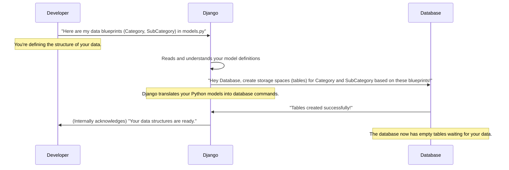

# Chapter 1: Data Models

Welcome to the start of our journey with the `document_category` project! Every great project begins with a solid foundation, and for applications that handle information, this foundation is built upon something called **Data Models**.

### Imagine a Super Organized Store

Think about a well-organized grocery store. It doesn't just pile all its items randomly. Instead, items are grouped: "Dairy," "Produce," "Snacks," "Drinks," and so on. Within "Dairy," you might find "Milk," "Cheese," and "Yogurt." Each item also has specific details, like its name, a picture, and whether it's currently available.

In our `document_category` project, we need to organize information in a similar way. We want to store details about different **Categories** of items (like "Electronics" or "Books") and **SubCategories** within them (like "Laptops" under "Electronics," or "Fantasy" under "Books"). How do we tell our application what kind of information to store for each Category and SubCategory, and how they relate to each other?

This is where **Data Models** come in!

### What are Data Models? The Blueprints of Your Data

In simple terms, **Data Models are like blueprints for your data**. Just as a blueprint shows how a building is structured (where the rooms are, what materials are used), a data model tells our application:

1.  **What kind of information** each "thing" (like a Category or SubCategory) will hold.
2.  **How different "things" are connected** to each other.

In Django (the framework our project uses), these blueprints are created using Python code in files called `models.py`.

### Let's Look at Our Project's Blueprints

Our `document_category` project primarily uses two main blueprints: `Category` and `SubCategory`. Let's explore them.

#### The `Category` Blueprint

The `Category` model is our blueprint for major groups, like "Electronics" or "Apparel." It specifies what details each category entry will have:

```python
# Category/models.py

from django.db import models

class Category(models.Model):
    # What kind of data will each Category entry have?
    name = models.CharField(max_length=50)
    slug = models.SlugField(max_length=100, unique=True)
    image = models.ImageField(upload_to='photos/categories', blank=True)
    status = models.CharField(max_length=10, choices=[('active', 'active'), ('deactive', 'deactive')], default='active')

    class Meta:
        verbose_name = 'category' # How Django refers to a single Category
        verbose_name_plural = 'categories' # How Django refers to multiple Categories

    def __str__(self):
        return self.name # What to show when we print a Category object
```

Let's break down what each line means:

*   `class Category(models.Model):`: This tells Django we're creating a new data model named `Category`. `models.Model` is like the basic template for all our data blueprints.
*   `name = models.CharField(max_length=50)`: This says every `Category` entry must have a `name`. `CharField` means it's a short piece of text, and `max_length=50` limits it to 50 characters.
*   `slug = models.SlugField(...)`: A `slug` is a URL-friendly version of the name (e.g., "electronics-items" instead of "Electronics Items"). `unique=True` means no two categories can have the same slug.
*   `image = models.ImageField(...)`: This field is for storing an image associated with the category. `blank=True` means it's optional; you don't *have* to provide an image.
*   `status = models.CharField(...)`: This helps us know if a category is `active` or `deactive`. The `choices` option makes sure we only pick one of these two values.
*   `class Meta:`: This is a special section where we give Django extra information about our model, like what to call it in plural form (`verbose_name_plural`).
*   `def __str__(self):`: This little function just makes it easy for us to see the `name` of the category whenever we look at a `Category` object in our code.

#### The `SubCategory` Blueprint (and Relationships!)

Now, let's look at the `SubCategory` model. Subcategories, like "Laptops" or "Fantasy Books," always belong to a larger `Category`. This is where data relationships come in!

```python
# Category/models.py (continued in the same file)

class SubCategory(models.Model):
    # This is the important part: linking SubCategory to Category!
    category = models.ForeignKey(Category, on_delete=models.CASCADE)

    # What kind of data will each SubCategory entry have?
    sub_name = models.CharField(max_length=50)
    slug = models.CharField(max_length=50)
    unit = models.CharField(max_length=3, choices=[('kg','kg'), ('pcs','pcs')])
    sub_image = models.ImageField(upload_to='photos/SubCategory', blank=True)
    percentage = models.FloatField(default=0) # Example numerical field
    GST = models.FloatField(default=0) # Another numerical field
    status = models.CharField(max_length=10, choices=[('active', 'active'), ('deactive', 'deactive')], default='active')

    class Meta:
        verbose_name = 'Subcategory'
        verbose_name_plural = 'Subcategories'

    def __str__(self):
        return self.sub_name
```

The most important part here is:

*   `category = models.ForeignKey(Category, on_delete=models.CASCADE)`: This line creates the "link" or "relationship." It says that every `SubCategory` entry *must* be connected to a `Category` entry.
    *   `ForeignKey` means it's a "one-to-many" relationship: one `Category` can have many `SubCategory` items, but each `SubCategory` belongs to only one `Category`.
    *   `on_delete=models.CASCADE`: This is a rule. It means if you delete a `Category` (e.g., "Electronics"), all its linked `SubCategory` items (like "Laptops," "Smartphones") will also be deleted automatically. It prevents "orphan" data.

### How Does Django Use These Blueprints?

When you define these models in `models.py`, you're essentially giving Django a set of instructions. Django then uses these instructions to create the actual storage places (like tables in a database) for your data.

Here's a simple idea of what happens behind the scenes:



In the next chapter, we'll learn the specific command we use to tell Django to *actually* create these storage spaces in our database. It's a process called [Database Migrations](02_database_migrations_.md).

### Conclusion

In this chapter, we've learned that **Data Models** are the fundamental blueprints for organizing information in our `document_category` project. They define:

*   **What data each entry holds** (e.g., a `Category` has a `name`, `image`, `status`).
*   **How different pieces of data are connected** (e.g., a `SubCategory` belongs to a `Category` using `ForeignKey`).

These blueprints, defined in `models.py`, are the first crucial step in setting up our application's data structure.

Now that we understand how to define our data's structure, let's move on to the next step: actually building these structures in our database. This is where [Database Migrations](02_database_migrations_.md) come into play!

---

<sub><sup>Generated by [AI Codebase Knowledge Builder](https://github.com/The-Pocket/Tutorial-Codebase-Knowledge).</sup></sub> <sub><sup>**References**: [[1]](https://github.com/snehabansal483/document_category/blob/277478989331eedb1362c71cf1b167d6ac739b2a/Category/migrations/0001_initial.py), [[2]](https://github.com/snehabansal483/document_category/blob/277478989331eedb1362c71cf1b167d6ac739b2a/Category/models.py)</sup></sub>
