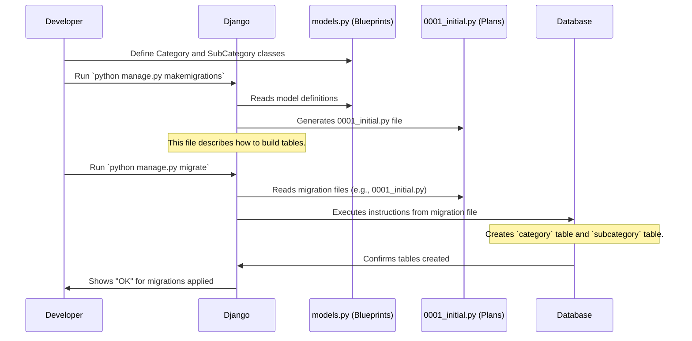

# Chapter 2: Database Migrations

Welcome back! In [Chapter 1: Data Models](01_data_models_.md), we learned that **Data Models** are like blueprints for our application's information. We defined what a `Category` and a `SubCategory` look like, and how they relate to each other in Python code (our `models.py` file).

But here's the thing: defining blueprints in Python code doesn't magically create the actual storage spaces in our database. It's like having a detailed architectural drawing for a house; you still need to lay the foundation and build the walls!

This is where **Database Migrations** come in.

### From Blueprints to Building: The Need for Migrations

Imagine you've drawn up your blueprints for `Category` and `SubCategory`. You want your application to actually store "Electronics" or "Laptops" information. How do you tell your database to get ready for this?

And what happens if later you decide a `Category` needs a new field, like `description`? Or maybe you want to change the `max_length` of a field? Manually going into the database and making changes can be risky, hard to track, and difficult to repeat on different computers or servers.

**Database Migrations solve these problems.** They are special files that act like a step-by-step instruction manual for your database. They describe how to build your database tables from scratch, or how to change them as your project grows. Think of them as **version control for your database's structure**.

Our goal in this chapter is to understand how to use migrations to turn our `Category` and `SubCategory` blueprints into actual tables in our database.

### Key Concepts: What are Migrations?

1.  **Instructions for the Database**: Migrations are Python files (automatically generated by Django) that contain instructions for modifying your database's structure. These instructions are typically things like "create a new table," "add a new column," or "delete an old column."
2.  **Tracking Changes**: Each time you make a change to your data models (e.g., adding a new field to your `Category` model), Django can create a new migration file. This file records *that specific change*. This way, you have a history of all changes made to your database's structure, just like you have a history of code changes in Git.
3.  **The `0001_initial.py` File**: When you first create your models, Django generates an initial migration file (often named `0001_initial.py`). This file contains all the instructions needed to create your *entire* database structure based on your initial [Data Models](01_data_models_.md). It's the "start building everything" instruction. You can find it in the `Category/migrations/` folder.

### How to Use Migrations: Building Our Database

Django provides two main commands to work with migrations:

1.  `makemigrations`: This command looks at your `models.py` file, compares it to the current state of your migration files, and generates *new* migration files if it detects any changes. It's like asking Django, "What changes do I need to prepare for?"
2.  `migrate`: This command takes those migration files and applies the instructions within them to your actual database. It's like telling Django, "Okay, now actually perform those changes on the database!"

Let's see them in action.

#### Step 1: Preparing the Migration Files (`makemigrations`)

First, we need to tell Django to create the migration files based on our `Category` and `SubCategory` models.

Open your terminal or command prompt, navigate to your project's root directory (where `manage.py` is located), and run:

```bash
python manage.py makemigrations
```

**What happens?**

Django will scan your `models.py` files. Since this is the first time (or the first time after making changes), it will detect your `Category` and `SubCategory` models as brand new structures. It will then generate a new file in your `Category/migrations/` folder.

You'll see output similar to this:

```
Migrations for 'Category':
  Category/migrations/0001_initial.py
    - Create model Category
    - Create model SubCategory
```

This output tells you:
*   A new migration file named `0001_initial.py` has been created inside the `Category/migrations/` folder.
*   This file contains instructions to "Create model Category" and "Create model SubCategory".

**Important**: Running `makemigrations` *does not* change your database yet. It only creates the Python files that describe the changes. These files are like the detailed construction plans that are drawn up but not yet acted upon.

#### Step 2: Applying the Changes to the Database (`migrate`)

Now that we have our migration files (our instructions), we need to tell Django to actually apply these instructions to our database.

In your terminal, run:

```bash
python manage.py migrate
```

**What happens?**

Django will look at all the migration files in all your apps, determine which ones haven't been applied to the database yet, and then execute their instructions.

You'll see output similar to this:

```
Operations to perform:
  Apply all migrations: admin, auth, Category, contenttypes, sessions
Running migrations:
  Applying contenttypes.0001_initial... OK
  Applying auth.0001_initial... OK
  Applying admin.0001_initial... OK
  Applying admin.0002_logentry_rename_action_flag... OK
  Applying admin.0003_logentry_add_action_flag_choices... OK
  Applying Category.0001_initial... OK
  Applying sessions.0001_initial... OK
```

This output shows that Django is applying migrations for several built-in Django apps (like `admin`, `auth`, `sessions`) and, most importantly for us, `Category.0001_initial`. The "OK" means it successfully applied those changes.

**Congratulations!** Your `Category` and `SubCategory` blueprints have now been translated into actual tables in your database, ready to store your data!

### Under the Hood: How it All Connects

Let's visualize the process and peek into the generated migration file.

First, recall our [Data Models](01_data_models_.md) in `Category/models.py`. These are the blueprints:

```python
# Category/models.py (simplified)

from django.db import models

class Category(models.Model):
    name = models.CharField(max_length=50)
    # ... other fields for Category ...

class SubCategory(models.Model):
    category = models.ForeignKey(Category, on_delete=models.CASCADE)
    sub_name = models.CharField(max_length=50)
    # ... other fields for SubCategory ...
```

When you run `python manage.py makemigrations`, Django reads these Python classes. It then translates them into Python code that describes database operations. This translated code goes into a new file, like `Category/migrations/0001_initial.py`.

Here's a *simplified* look at what that `0001_initial.py` file might contain, focusing on the `Category` model for brevity:

```python
# Category/migrations/0001_initial.py (simplified snippet)

from django.db import migrations, models

class Migration(migrations.Migration):
    initial = True
    dependencies = []
    operations = [
        migrations.CreateModel(
            name='Category',
            fields=[
                ('id', models.BigAutoField(auto_created=True, primary_key=True, serialize=False, verbose_name='ID')),
                ('name', models.CharField(max_length=50)),
                # ... more field definitions here, automatically generated ...
            ],
            options={
                'verbose_name': 'category',
                'verbose_name_plural': 'categories',
            },
        ),
        # ... Similar code for creating the 'SubCategory' model/table ...
    ]
```

Notice the `migrations.CreateModel` part. This is the core instruction. It tells Django: "Hey, when you run this migration, create a database table named 'Category' with these specific columns (fields) like 'id' and 'name'."

The `SubCategory` table creation instructions are also in this same `0001_initial.py` file, including the `ForeignKey` relationship to `Category`.

Here's how the whole process flows:



This sequence shows that `makemigrations` is about *preparing* the database changes by writing them into files, and `migrate` is about *applying* those prepared changes to the actual database.

### Conclusion

In this chapter, we've unlocked a crucial part of building robust applications: **Database Migrations**. We learned that:

*   Migrations are like version control for your database structure, allowing you to track and apply changes systematically.
*   `python manage.py makemigrations` creates the Python files that describe your database changes (e.g., `0001_initial.py`).
*   `python manage.py migrate` applies those changes to your actual database, building or updating tables.

You've now successfully translated your [Data Models](01_data_models_.md) into real storage spaces in your database! But how do we actually *see* and *manage* the data inside these tables without writing complex code? That's what we'll explore in the next chapter: [Django Admin Interface](03_django_admin_interface_.md)!

---

<sub><sup>Generated by [AI Codebase Knowledge Builder](https://github.com/The-Pocket/Tutorial-Codebase-Knowledge).</sup></sub> <sub><sup>**References**: [[1]](https://github.com/snehabansal483/document_category/blob/277478989331eedb1362c71cf1b167d6ac739b2a/Category/migrations/0001_initial.py), [[2]](https://github.com/snehabansal483/document_category/blob/277478989331eedb1362c71cf1b167d6ac739b2a/Category/models.py)</sup></sub>