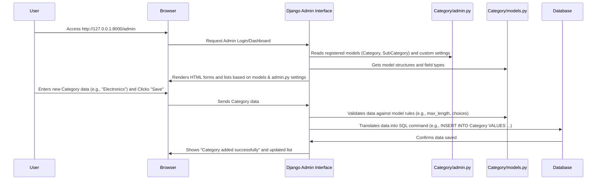

# Chapter 3: Django Admin Interface

Welcome back! In our last chapter, [Chapter 2: Database Migrations](02_database_migrations_.md), we learned how to use Django's migration system to turn our data blueprints (defined in [Chapter 1: Data Models](01_data_models_.md)) into actual storage spaces – tables – in our database. You've successfully built the foundation and even the framework of your data storage!

But now that we have these empty tables, how do we put data into them? How do we add a new "Electronics" category, or a "Laptops" subcategory, and then later edit or delete them? Doing this directly by writing code or messing with the database itself can be tricky and prone to errors.

Imagine you have a beautifully designed car. You know where the engine is, how the wheels work, and how the gears are connected (our data models and migrations!). But to *drive* it, you don't need to be a mechanic; you need a dashboard with simple controls like a steering wheel, accelerator, and brake pedal.

This is exactly what the **Django Admin Interface** provides for your project!

### What is the Django Admin Interface? Your Project's Dashboard

The Django Admin Interface is a powerful, built-in, web-based control panel that comes with every Django project. It's designed to help you, the administrator, easily manage your project's data without writing a single line of web application code.

Think of it as your project's **dashboard**. Just like a car's dashboard gives you controls for its functions (speed, fuel, lights), the Django Admin allows authorized users to:

*   **Create** new data entries (e.g., add a new `Category` called "Sports").
*   **View** all existing data (e.g., see a list of all `Categories` and `SubCategories`).
*   **Update** (or edit) existing data (e.g., change "Sports" to "Outdoor & Sports").
*   **Delete** data entries (e.g., remove an old `SubCategory`).

All of this happens through a user-friendly web interface that Django automatically generates for you, based on your [Data Models](01_data_models_.md).

Our goal in this chapter is to understand how to get access to this dashboard and use it to manage our `Category` and `SubCategory` data.

### Key Concepts

1.  **Built-in & Automatic**: The Django Admin is part of Django itself. Once you define your [Data Models](01_data_models_.md) and run [Database Migrations](02_database_migrations_.md), Django can automatically create a basic administration interface for them.
2.  **`admin.py`**: This is the special Python file in your app (e.g., `Category/admin.py`) where you "tell" Django which of your models you want to see in the admin dashboard and how you want them to look. It's where you customize the dashboard's controls and display for your data.
3.  **Superuser**: To access the Django Admin dashboard, you need special permission. You'll log in as a "superuser," which is an account with full administrative powers.

### How to Use the Django Admin: Managing Our Data

Let's get our dashboard up and running!

#### Step 1: Create a Superuser Account

First, we need an administrator account to log into the admin panel. This is a one-time setup step.

Open your terminal or command prompt, navigate to your project's root directory (where `manage.py` is located), and run:

```bash
python manage.py createsuperuser
```

**What happens?**

Django will ask you for a username, email address (optional), and a password for your new superuser account.

```
Username (leave blank to use 'your_username'): admin
Email address: admin@example.com
Password:
Password (again):
Superuser created successfully.
```

Choose a simple username and password for now (like `admin`/`admin123`) for learning purposes. Make sure you remember them!

#### Step 2: Start the Development Server

Next, we need to run our Django project so we can access it through our web browser.

In your terminal, run:

```bash
python manage.py runserver
```

**What happens?**

Django will start a small web server on your computer. You'll see output like this:

```
Performing system checks...

System check identified no issues (0 silenced).

You can now view your project at:

  http://127.0.0.1:8000/
```

This tells you your project is now running and can be accessed in your web browser at the given address.

#### Step 3: Access the Django Admin Dashboard

Open your web browser and go to the address `http://127.0.0.1:8000/admin`.

You will see a login page for the Django administration. Enter the username and password you created in Step 1.

**Congratulations!** You're now on your project's administrative dashboard. You'll see some default sections like "Authentication and Authorization" (for managing users and groups). However, our `Category` and `SubCategory` models aren't visible yet.

#### Step 4: Register Our Models in `admin.py`

For our `Category` and `SubCategory` models to appear and be manageable in the admin dashboard, we need to "register" them in the `admin.py` file within our `Category` app. This file also allows us to customize how these models look and behave in the admin.

Let's look at the `Category/admin.py` file:

```python
# Category/admin.py
from django.contrib import admin
from .models import Category, SubCategory # 1. Import our models
from django.utils.html import format_html # Needed for image display
import admin_thumbnails # Special tool for image display

# 2. Customize how Category model looks in admin
class CategoryAdmin(admin.ModelAdmin):
    def thumbnail(self, object):
        # A small function to show a tiny image in the list
        return format_html(''.format(object.image.url))
    thumbnail.short_description = "Image" # Label for the image column

    # Automatically fill the 'slug' field based on 'name'
    prepopulated_fields = {'slug': ('name',)}
    # What columns to show in the list view
    list_display = ('id', 'name', 'slug', 'thumbnail', 'status')
    # Which columns should be clickable links to edit the item
    list_display_links = ('id', 'name', 'slug', 'thumbnail')

# 3. Customize how SubCategory model looks in admin
@admin_thumbnails.thumbnail('sub_image') # Use admin_thumbnails to show image easily
class SubCategoryAdmin(admin.ModelAdmin):
    # This 'thumbnail' function is simpler because of @admin_thumbnails
    def thumbnail(self, object):
        return format_html(''.format(object.sub_image.url))
    thumbnail.short_description = "SubImage"

    # Automatically fill the 'slug' field based on 'sub_name'
    prepopulated_fields = {'slug': ('sub_name',)}
    # What columns to show in the list view
    list_display= ('id', 'sub_name', 'slug', 'category', 'thumbnail', 'unit', 'percentage', 'status')
    # Which columns should be clickable links to edit the item
    list_display_links = ('id', 'sub_name', 'slug', 'category', 'thumbnail')

# 4. Tell Django Admin to include our models using our custom settings
admin.site.register(Category, CategoryAdmin)
admin.site.register(SubCategory, SubCategoryAdmin)
```

**Let's break down the important parts:**

1.  `from .models import Category, SubCategory`: We import our blueprints (models) from the `models.py` file so we can tell Django about them.
2.  `class CategoryAdmin(admin.ModelAdmin):`: This is a special class that tells Django how to display and manage our `Category` model in the admin.
    *   `prepopulated_fields = {'slug': ('name',)}`: This is super handy! When you type a `name` for a new category, Django will automatically fill in the `slug` field (the URL-friendly version) for you.
    *   `list_display = ('id', 'name', 'slug', 'thumbnail', 'status')`: This determines which columns appear when you view a list of categories in the admin. `thumbnail` is a custom column we created to show a small image.
    *   The `thumbnail` function and `admin_thumbnails` (an optional helper tool) are used to display a small preview of the image directly in the list, making it more visual.
3.  `class SubCategoryAdmin(admin.ModelAdmin):`: This is similar to `CategoryAdmin`, but it applies to our `SubCategory` model. It also uses `prepopulated_fields` and `list_display` for easy management. Notice `category` in `list_display` – this automatically shows which main `Category` each `SubCategory` belongs to!
4.  `admin.site.register(Category, CategoryAdmin)` and `admin.site.register(SubCategory, SubCategoryAdmin)`: These are the crucial lines! They "register" our `Category` and `SubCategory` models with the Django Admin. We also tell Django to use our custom `CategoryAdmin` and `SubCategoryAdmin` classes to control their appearance.

After you save changes to `Category/admin.py` (if the server is running, it will usually reload automatically), refresh your browser page at `http://127.0.0.1:8000/admin`.

**Now you should see "Categories" and "Subcategories" listed under your "CATEGORY" app!**

#### Step 5: Managing Data Through the Admin

Click on "Categories." You'll see a list of categories (currently empty).

*   Click "Add category" on the top right.
*   Fill in a `name` (e.g., "Electronics"). Watch how the `slug` field automatically fills in!
*   You can upload an `image` and set the `status`.
*   Click "Save."

You've just created your first `Category` entry *without writing any backend code* for it! Repeat this for a few categories.

Now, go back to the main admin page and click on "Subcategories."

*   Click "Add subcategory."
*   Fill in `sub_name` (e.g., "Laptops"). The `slug` will again prepopulate.
*   **Important:** Select a `Category` from the dropdown list (e.g., "Electronics"). This is how you link a SubCategory to its parent Category, leveraging the `ForeignKey` relationship we defined in [Chapter 1: Data Models](01_data_models_.md).
*   Fill in other details like `unit`, `percentage`, and `GST`.
*   Click "Save."

You can now easily create, view, edit (by clicking on an existing item), and delete (by selecting items and using the "Action" dropdown) your data through this powerful interface.

### Under the Hood: How the Admin Works Its Magic

How does Django turn your simple Python definitions into a fully functional web interface?

Let's trace the journey when you use the Django Admin:



Essentially, when you access the admin, Django reads your `admin.py` file to see *which* models you want to manage and *how*. It then consults your `models.py` for the actual structure of those models (what fields they have, their types, relationships). Using all this information, Django dynamically generates the necessary HTML forms, tables, and buttons to let you interact with your database. When you save changes, Django handles all the complex database queries for you.

### Conclusion

In this chapter, you've gained a fundamental understanding of the **Django Admin Interface**:

*   It's a **built-in, secure control panel** for managing your project's data without writing web code.
*   You use `python manage.py createsuperuser` to get an **admin account**.
*   You "register" your [Data Models](01_data_models_.md) in your app's `admin.py` file to make them visible and manageable in the admin.
*   The `admin.py` file also allows you to **customize** how your models are displayed and managed (e.g., which columns to show, how fields are pre-filled).

You now have a powerful tool to populate and maintain your `Category` and `SubCategory` data! But what if we want to get this data *out* of our database and present it in a standard format that other applications (like mobile apps or websites) can understand? That's where **Data Serialization** comes in, which we'll explore in the next chapter!

[Chapter 4: Data Serialization](04_data_serialization_.md)

---

<sub><sup>Generated by [AI Codebase Knowledge Builder](https://github.com/The-Pocket/Tutorial-Codebase-Knowledge).</sup></sub> <sub><sup>**References**: [[1]](https://github.com/snehabansal483/document_category/blob/277478989331eedb1362c71cf1b167d6ac739b2a/Category/admin.py)</sup></sub>