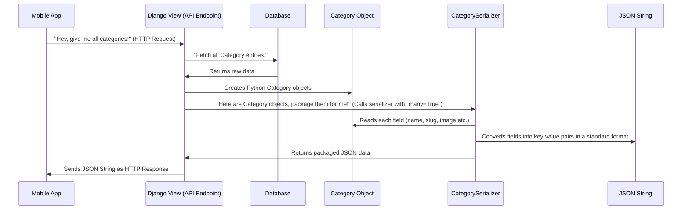

# Chapter 4: Data Serialization

Welcome back, aspiring developer! In our previous chapter, [Chapter 3: Django Admin Interface](03_django_admin_interface_.md), we learned how to easily manage our `Category` and `SubCategory` data directly within our Django project's dashboard. You can now add, view, edit, and delete data using a user-friendly web interface. That's great for administrators!

But what if you want to share this data with other applications? Imagine you're building:

*   A **mobile app** that needs to display all product categories.
*   A **different website** (perhaps built with a different technology) that wants to list your subcategories.
*   A **JavaScript application** running in a user's browser that needs to fetch category information.

These external applications don't understand Django's internal `Category` or `SubCategory` objects directly. They speak different languages, but they all understand a few universal data formats, like **JSON** (JavaScript Object Notation) or XML.

This is where **Data Serialization** comes in!

### What is Data Serialization? Packaging Your Data for Travel

Imagine you have a beautifully crafted, complex object in your hands – say, a detailed `Category` object in our Django system, which has a `name`, an `image`, a `status`, and more. Now, you need to send this object through the internet to a friend (another program) who lives far away.

You can't just mail the object itself! You need to:

1.  **Package it up:** Convert the complex object into a simple, standardized format, like a neatly written list of its properties on a piece of paper, or packing it into a universally recognized shipping box. This "paper list" or "shipping box" is often **JSON**.
2.  **Send it:** Transmit this simple, standardized package over the internet.

**Data Serialization is the process of converting complex data (like our Django `Category` or `SubCategory` objects) into a simple, standardized format (like JSON or XML) that can be easily stored, transmitted, and understood by different systems.**

The reverse process, converting the simple format back into a complex object, is called **Deserialization**.

In our `document_category` project, we'll use a powerful tool called **Django REST Framework** (DRF) to handle serialization. The conversion rules are defined in a special file: `Category/serializers.py`. This file ensures our data can be neatly packaged and sent as a readable string, and also converted back from a string into an object if needed.

### Key Concepts for Data Serialization

1.  **Serialization**: The act of converting complex data (like a Django model instance) into a simple, universally understood format (like JSON or XML).
2.  **Deserialization**: The act of converting the simple, universally understood format back into a complex data object.
3.  **JSON (JavaScript Object Notation)**: A very popular, lightweight text-based data exchange format. It's easy for humans to read and write, and easy for machines to parse and generate. It looks like a collection of key-value pairs, similar to Python dictionaries.
4.  **`serializers.py`**: In Django REST Framework, this is the Python file where you define the "rules" or "blueprints" for how your Django models should be converted into JSON (or other formats) and vice-versa.
5.  **`ModelSerializer`**: A special class provided by Django REST Framework that makes it incredibly easy to create serializers directly from your Django models. It automatically maps model fields to serializer fields.

### How to Use Data Serialization for Our Categories

Let's see how our `serializers.py` file helps us package our `Category` and `SubCategory` data.

First, recall our `Category` model from [Chapter 1: Data Models](01_data_models_.md). When you retrieve a `Category` from the database, it's a Python object like this:

```python
# Imagine this is a Category object in Python
my_category_object = {
    'id': 1,
    'name': 'Electronics',
    'slug': 'electronics',
    'image': '/media/photos/categories/electronics.jpg',
    'status': 'active'
}
```

We want to convert this into a JSON string that looks something like this, so a mobile app can easily read it:

```json
{
    "id": 1,
    "name": "Electronics",
    "slug": "electronics",
    "image": "http://example.com/media/photos/categories/electronics.jpg",
    "status": "active"
}
```

Here's how we define the rules for this conversion in `Category/serializers.py`:

```python
# Category/serializers.py (Simplified)
from rest_framework import serializers
from .models import Category, SubCategory

# Define the packing instructions for our Category objects
class CategorySerializer(serializers.ModelSerializer):
    class Meta: # This inner class gives instructions to ModelSerializer
        model = Category # Tell it which Django Model this serializer is for
        fields = '__all__' # Tell it to include ALL fields from the Category model
```

**Explanation:**

*   `from rest_framework import serializers`: We import the necessary tools from Django REST Framework.
*   `from .models import Category, SubCategory`: We import our Django models that we want to serialize.
*   `class CategorySerializer(serializers.ModelSerializer):`: We create a new serializer called `CategorySerializer`. By inheriting from `serializers.ModelSerializer`, we tell Django REST Framework to automatically figure out how to convert a `Category` model instance.
*   `class Meta:`: This special inner class holds configurations for our serializer.
*   `model = Category`: This line is crucial! It links our `CategorySerializer` directly to our `Category` Django model.
*   `fields = '__all__':` This tells the serializer to include *all* the fields from the `Category` model (`id`, `name`, `slug`, `image`, `status`) in the serialized output. It's a quick way to include everything. You could also list specific fields if you only wanted some of them, like `fields = ('name', 'status')`.

We do something similar for our `SubCategory` model:

```python
# Category/serializers.py (Simplified, continued)

class AllSubCategorySerializer(serializers.ModelSerializer):
    class Meta:
        model = SubCategory
        fields = '__all__'
```

This `AllSubCategorySerializer` works just like `CategorySerializer`, but it's for `SubCategory` objects. It will convert all fields of a `SubCategory` object into a simple format.

#### Using Serializers in Practice

These serializers are then used in our **API Endpoints** (which we'll cover in detail in [Chapter 5: API Endpoints](05_api_endpoints_.md)) to prepare data before sending it out.

For example, in `Category/views.py`, when a request comes in asking for a list of categories:

```python
# Category/views.py (Simplified)
from rest_framework.views import APIView
from rest_framework.response import Response
from .serializers import CategorySerializer, AllSubCategorySerializer # Import our serializers
from .models import Category, SubCategory

class CategoryList(APIView):
    def get(self, request):
        # 1. Get all Category objects from the database
        all_categories = Category.objects.all()

        # 2. Pass them to our CategorySerializer for packaging
        # `many=True` means we're serializing a list of objects, not just one
        serializer = CategorySerializer(all_categories, many=True)

        # 3. Return the packaged data (which is now in a simple format, like JSON)
        return Response(serializer.data)

class AllSubCategoryList(APIView):
    def get(self, request):
        all_subcategories = SubCategory.objects.all()
        serializer = AllSubCategorySerializer(all_subcategories, many=True)
        return Response(serializer.data)
```

**What happens when `serializer.data` is accessed?**

If `all_categories` contains two `Category` objects:
`Category(id=1, name='Electronics', ...)`
`Category(id=2, name='Books', ...)`

The `serializer.data` will produce a list of dictionaries, which Django REST Framework then automatically converts into a JSON string that looks like this:

```json
[
    {
        "id": 1,
        "name": "Electronics",
        "slug": "electronics",
        "image": "http://example.com/media/photos/categories/electronics.jpg",
        "status": "active"
    },
    {
        "id": 2,
        "name": "Books",
        "slug": "books",
        "image": "http://example.com/media/photos/categories/books.jpg",
        "status": "active"
    }
]
```

This JSON string is what gets sent over the internet to the mobile app or other website. They can then easily read this standardized data.

### Under the Hood: The Serialization Process

Let's visualize how your Django model object gets transformed into a JSON string ready for transport.



**Diving a bit deeper into `serializers.py`:**

When you define `CategorySerializer(serializers.ModelSerializer)` and set `model = Category` and `fields = '__all__'`, Django REST Framework intelligently:

1.  **Inspects `Category` model**: It looks at the `Category` model you defined in `models.py` (from [Chapter 1: Data Models](01_data_models_.md)) and understands all its fields (`name`, `slug`, `image`, `status`, plus an automatic `id`).
2.  **Creates corresponding serializer fields**: For each model field, it creates a matching serializer field that knows how to convert data to/from the Python object and the target format (like JSON). For example, `models.CharField` becomes `serializers.CharField`.
3.  **Handles relationships**: Even `ForeignKey` relationships are handled.
    *   For `AllSubCategorySerializer`, when `fields = '__all__'` is used, the `category` field (which is a `ForeignKey` to `Category`) will typically show up as the `id` of the related `Category` object in the JSON. For example, a `SubCategory` for "Laptops" might show `{"id": 101, "sub_name": "Laptops", "category": 1, ...}` where `1` is the `id` of the "Electronics" `Category`.
    *   There's also another serializer defined in the project, `SubCategorySerializer`, which shows a more advanced example using `serializers.StringRelatedField()`:

        ```python
        # Category/serializers.py (Snippet for custom behavior)

        class SubCategorySerializer(serializers.ModelSerializer):
            # Instead of just showing the Category ID, this will show the Category's name!
            sub_name = serializers.StringRelatedField()
            class Meta:
                model = SubCategory
                fields = '__all__'
        ```
        In this specific `SubCategorySerializer`, `sub_name = serializers.StringRelatedField()` is used. This means that instead of displaying the ID of the related `Category` in the JSON, it would display the `__str__` representation of the `Category` object (which we defined as `return self.name` in our `Category` model). So, a "Laptops" subcategory might show `{"id": 101, "sub_name": "Laptops", "category": "Electronics", ...}`. This demonstrates how serializers give you fine-grained control over the output.

By using `serializers.ModelSerializer`, much of this complex mapping is done automatically, making it very efficient to prepare our data for the outside world.

### Conclusion

In this chapter, we've explored the essential concept of **Data Serialization**:

*   It's the process of **packaging complex data** (like our Django model objects) into a simple, universal format (like **JSON**) for storage or transmission.
*   The `Category/serializers.py` file contains the **rules** for this packaging using Django REST Framework's `ModelSerializer`.
*   `ModelSerializer` automatically maps your Django model fields to fields in the serialized output, making the process straightforward.
*   This serialized data is then ready to be sent to other applications (like mobile apps or other websites) that don't directly understand Django's internal objects.

You now understand how our organized data can be transformed into a portable format. In the next chapter, we'll put these serializers to work by creating actual **API Endpoints** that external applications can call to fetch our category and subcategory data!

[Chapter 5: API Endpoints](05_api_endpoints_.md)

---

<sub><sup>Generated by [AI Codebase Knowledge Builder](https://github.com/The-Pocket/Tutorial-Codebase-Knowledge).</sup></sub> <sub><sup>**References**: [[1]](https://github.com/snehabansal483/document_category/blob/277478989331eedb1362c71cf1b167d6ac739b2a/Category/serializers.py), [[2]](https://github.com/snehabansal483/document_category/blob/277478989331eedb1362c71cf1b167d6ac739b2a/Category/views.py)</sup></sub>