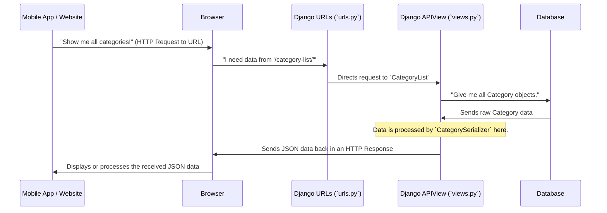

# Chapter 5: API Endpoints

Welcome to the final chapter of our `document_category` project tutorial! In our journey so far, we've laid a strong foundation:

*   In [Chapter 1: Data Models](01_data_models_.md), we created the blueprints for our `Category` and `SubCategory` data.
*   In [Chapter 2: Database Migrations](02_database_migrations_.md), we used those blueprints to build actual storage spaces (tables) in our database.
*   In [Chapter 3: Django Admin Interface](03_django_admin_interface_.md), we learned how to easily add and manage data in those tables using a web dashboard.
*   And most recently, in [Chapter 4: Data Serialization](04_data_serialization_.md), we learned how to "package" our complex Django data into a simple, universal format like JSON, ready for travel across the internet.

Now that our data is beautifully organized, stored, and packaged, how do other computer programs or websites actually *get* it? How does a mobile app know where to ask for the list of categories? How does a separate front-end website know where to send a request for all subcategories?

This is where **API Endpoints** come into play!

### What are API Endpoints? Your Data's Doorways

Think of your Django project as a building that holds valuable information (your `Category` and `SubCategory` data). This building has many rooms (your models, views, etc.). For external visitors (other applications) to get specific information, they don't wander through the whole building. Instead, they need a specific address or **doorway** to knock on.

**API Endpoints are these specific doorways or addresses that other computer programs (like mobile apps, websites, or other services) can visit to either request or send data.**

Each endpoint is a unique URL (a web address) that, when visited, triggers a specific action on your server. For our `document_category` project, URLs like `/category-list/` and `/all-subcategory-list/` are these addresses.

When an external application "visits" one of these endpoints:

1.  Your Django project recognizes the address.
2.  It directs the request to a specific **`APIView`** (which acts like a doorman or processor).
3.  This `APIView` then fetches the necessary data from the database.
4.  It uses a **`Serializer`** (as we learned in [Chapter 4: Data Serialization](04_data_serialization_.md)) to package the data into a standard format (like JSON).
5.  Finally, it sends this packaged data back to the requesting application.

This entire process makes your project's data accessible and usable by any other application or front-end interface, making your project a useful "API" (Application Programming Interface).

### Key Concepts

1.  **URL (Uniform Resource Locator)**: The actual web address (e.g., `http://127.0.0.1:8000/category-list/`) that identifies an API Endpoint.
2.  **`path()`**: A Django function used in `urls.py` to define these URLs and link them to specific "views."
3.  **`APIView`**: A special class provided by Django REST Framework (DRF) that processes requests coming into an endpoint. It handles different types of requests (like "GET" for requesting data, "POST" for sending new data, etc.). It's like the "doorman" or "processor" that handles requests at a specific doorway.
4.  **`Response`**: A Django REST Framework object used by the `APIView` to send data back to the requesting application. This is where your serialized (packaged) data goes.

### How to Use API Endpoints: Making Our Data Available

Let's look at how our project sets up these doorways using files like `Category/urls.py` and `Category/views.py`.

#### Step 1: Defining the Addresses (`urls.py`)

First, we tell Django what addresses (URLs) we want to have and which "doorman" (`APIView`) should handle requests that arrive at that address. This is done in `Category/urls.py`:

```python
# Category/urls.py
from django.urls import path
from .views import * # Import all views from our views.py

urlpatterns = [
    # This says: when someone visits 'category-list/',
    # let CategoryList handle it.
    path('category-list/', CategoryList.as_view()),

    # This says: when someone visits 'all-subcategory-list/',
    # let AllSubCategoryList handle it.
    path('all-subcategory-list/', AllSubCategoryList.as_view()),
]
```

**Explanation:**

*   `from django.urls import path`: We import the `path` function, which helps us define URL patterns.
*   `from .views import *`: This line imports all the "doorman" (APIView) classes we've defined in our `views.py` file.
*   `urlpatterns = [...]`: This is a list where we define all the URL patterns for our app.
*   `path('category-list/', CategoryList.as_view())`: This is an endpoint definition.
    *   `'category-list/'`: This is the specific address part. When added to our base server address (e.g., `http://127.0.0.1:8000/`), it becomes `http://127.0.0.1:8000/category-list/`.
    *   `CategoryList.as_view()`: This tells Django to use our `CategoryList` class (which is an `APIView`) to handle any requests coming to this address. `.as_view()` is necessary because `CategoryList` is a class, and we need to turn it into a function that Django can call.

#### Step 2: Handling the Requests (`views.py`)

Next, we define what actually happens when someone "visits" one of these addresses. This is handled by our `APIView` classes in `Category/views.py`:

```python
# Category/views.py
from rest_framework.views import APIView
from rest_framework.response import Response
from .serializers import CategorySerializer, AllSubCategorySerializer # Import our serializers
from .models import Category, SubCategory

class CategoryList(APIView):
    def get(self, request):
        # 1. Get all Category data from the database
        all_categories = Category.objects.all()

        # 2. Package the data using our CategorySerializer
        # (many=True means we are packaging a list of items)
        serializer = CategorySerializer(all_categories, many=True)

        # 3. Send the packaged data back as a response
        return Response(serializer.data)

class AllSubCategoryList(APIView):
    def get(self, request):
        # 1. Get all SubCategory data from the database
        all_subcategories = SubCategory.objects.all()

        # 2. Package the data using our AllSubCategorySerializer
        serializer = AllSubCategorySerializer(all_subcategories, many=True)

        # 3. Send the packaged data back
        return Response(serializer.data)
```

**Explanation:**

*   `from rest_framework.views import APIView`: We import the `APIView` class, which is the base for our doorman classes.
*   `from rest_framework.response import Response`: We import `Response`, which helps us send structured data back to the client.
*   `from .serializers import ...` and `from .models import ...`: We import our [Data Models](01_data_models_.md) and [Data Serializers](04_data_serialization_.md) so our `APIView` can work with them.
*   `class CategoryList(APIView):`: This defines our "doorman" for categories.
    *   `def get(self, request):`: This special method handles "GET" requests. A "GET" request is what happens when a browser or mobile app simply tries to *fetch* information from an address.
    *   `cat = Category.objects.all()`: This line uses our [Data Model](01_data_models_.md) to fetch *all* `Category` objects from the database.
    *   `serializer = CategorySerializer(cat, many = True)`: This is where our [Data Serialization](04_data_serialization_.md) comes in! We pass the fetched `Category` objects to our `CategorySerializer` to package them into a simple format (like JSON). `many=True` is important because we're fetching *many* categories, not just one.
    *   `return Response(serializer.data)`: This line sends the packaged data back to the requesting application. `serializer.data` contains the beautiful JSON-ready data from our serializer.

The `AllSubCategoryList` class works in exactly the same way, but for `SubCategory` data.

#### Example: What happens when you visit an API Endpoint?

Let's assume your Django development server is running (you can start it with `python manage.py runserver`).

**Input:**
Open your web browser or a tool like Postman and go to:
`http://127.0.0.1:8000/category-list/`

**Output:**
You will see raw JSON data displayed in your browser, something like this:

```json
[
    {
        "id": 1,
        "name": "Electronics",
        "slug": "electronics",
        "image": "http://127.0.0.1:8000/media/photos/categories/electronics.jpg",
        "status": "active"
    },
    {
        "id": 2,
        "name": "Books",
        "slug": "books",
        "image": null,
        "status": "active"
    }
]
```

This is the packaged data, ready for any external application to read and use! If you visit `http://127.0.0.1:8000/all-subcategory-list/`, you'll see a similar JSON list of all subcategories.

### Under the Hood: The Journey Through an API Endpoint

Let's visualize the entire process from an external application requesting data to receiving it:



The flow is a direct chain from the client's request to your database and back, with `urls.py` acting as the map and `views.py` doing the heavy lifting of fetching and packaging.

**Key Roles in the Endpoint System:**

| Component         | Role (Analogy)              | What it does for API Endpoints                                                |
| :---------------- | :-------------------------- | :---------------------------------------------------------------------------- |
| **URL (Path)**    | The "Address" or "Doorway"  | Defines the specific web address where data can be requested or sent.         |
| **`urls.py`**     | The "Map" of the building   | Links a specific URL to a particular `APIView` ("doorman").                   |
| **`APIView`**     | The "Doorman" or "Processor"| Receives the request, interacts with the database, and prepares the response. |
| **`models.py`**   | The "Blueprints" for data   | Defines the structure of the data (`Category`, `SubCategory`).                |
| **`serializers.py`**| The "Packaging Machine"     | Converts complex data from `models.py` into simple formats like JSON.         |
| **`Response`**    | The "Delivery Van"          | Carries the packaged data back to the requesting application.                 |

### Conclusion

In this chapter, you've learned about **API Endpoints**, the crucial final step in making your project's data accessible to the outside world:

*   **API Endpoints are specific web addresses** (URLs) that other applications can visit to interact with your data.
*   They are defined using `path()` in `urls.py`, which maps a URL to a specific `APIView`.
*   **`APIView` classes (in `views.py`) are the processors** that handle incoming requests, fetch data from your [Database](02_database_migrations_.md) (using [Data Models](01_data_models_.md)), and use [Data Serializers](04_data_serialization_.md) to package it into a readable format (like JSON).
*   The `Response` object then sends this packaged data back to the requesting client.

You now understand how the `document_category` project structures its data, makes it manageable, and ultimately exposes it in a standard way through well-defined API Endpoints. This makes your project's data incredibly flexible and ready to be used by mobile apps, other websites, or any other system that needs access to your categories and subcategories!

---

<sub><sup>Generated by [AI Codebase Knowledge Builder](https://github.com/The-Pocket/Tutorial-Codebase-Knowledge).</sup></sub> <sub><sup>**References**: [[1]](https://github.com/snehabansal483/document_category/blob/277478989331eedb1362c71cf1b167d6ac739b2a/Category/urls.py), [[2]](https://github.com/snehabansal483/document_category/blob/277478989331eedb1362c71cf1b167d6ac739b2a/Category/views.py)</sup></sub>